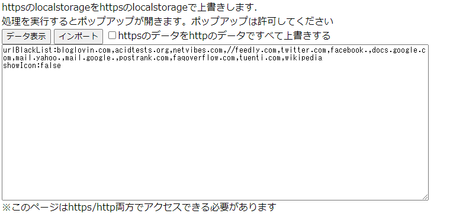

# import_http_storage_page_sample

localStorageをダンプセーブするサンプルです

`importLocalStorage.html` をhttps/http両方でアクセスできるようにした状態で、
https/httpでアクセスすると該当ドメインのローカストレージダンプ/セーブが出来ます

`importLocalStorage2.html` については直接httpsよりインポートする機能を持ちますがポップアップが出現します。

※keyの先頭がhttp:のときhttps:に変換します

